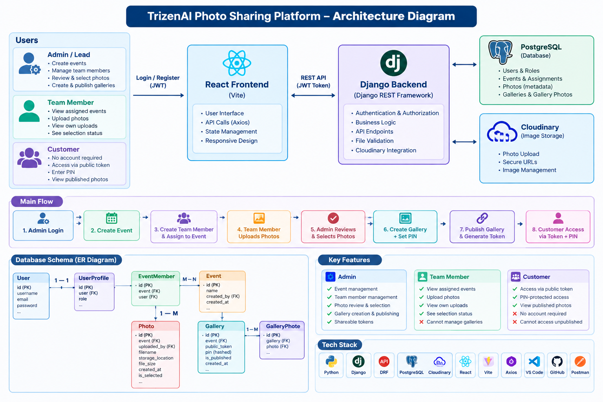

# TrizenAI Photo Sharing Platform

A full-stack photo-sharing platform for managing event photos, reviewing and selecting photos, publishing galleries, and securely sharing galleries with customers using a PIN.

## Overview

The platform supports three types of users:

- **Admin / Lead** – creates events, creates team members, assigns team members to events, reviews uploaded photos, selects photos, creates galleries, and publishes galleries.
- **Team Member** – views assigned events, uploads event photos, and views their own uploaded photos.
- **Customer** – does not need an account. Customers access a published gallery using a shareable gallery token and PIN.

## Main Workflow

1. Admin logs in.
2. Admin creates an event.
3. Admin creates team members.
4. Admin assigns team members to the event.
5. Team members upload photos for their assigned events.
6. Admin reviews uploaded photos.
7. Admin selects photos for the customer gallery.
8. Admin creates a gallery and sets a PIN.
9. Selected photos are added to the gallery.
10. Admin publishes the gallery.
11. Customer opens the public gallery using the shareable token and enters the PIN.
12. Customer views the published photos.

## Features

### Admin

- Admin authentication
- Create events
- Create team members
- Assign team members to events
- View all photos belonging to owned events
- Select or unselect photos
- Create galleries
- Add selected photos to galleries
- Publish galleries
- Generate shareable public gallery tokens

### Team Member

- Login using JWT authentication
- View assigned events
- Upload multiple image files
- View own uploaded photos
- See photo selection status
- Cannot upload to unassigned events
- Cannot manage or publish galleries

### Customer

- No account required
- Access gallery using public token
- PIN-protected gallery access
- View photos only after successful PIN verification
- Cannot access unpublished galleries
- Incorrect PIN is rejected

## Technology Stack

### Backend

- Python
- Django
- Django REST Framework
- PostgreSQL
- JWT Authentication
- Simple JWT
- Cloudinary

### Frontend

- React
- Vite
- Axios
- HTML
- CSS

### Development Tools

- Visual Studio Code
- Git / GitHub
- Postman

## Architecture

The application follows a client-server architecture.

```text
+----------------------+
|      React Frontend  |
|        (Vite)        |
+----------+-----------+
           |
           | REST API / JWT
           v
+----------------------+
|    Django Backend    |
|   Django REST API    |
+----------+-----------+
           |
      +----+----+
      |         |
      v         v
+----------+ +------------+
|PostgreSQL| | Cloudinary |
| Database | |   Storage  |
+----------+ +------------+
### System Architecture Diagram

